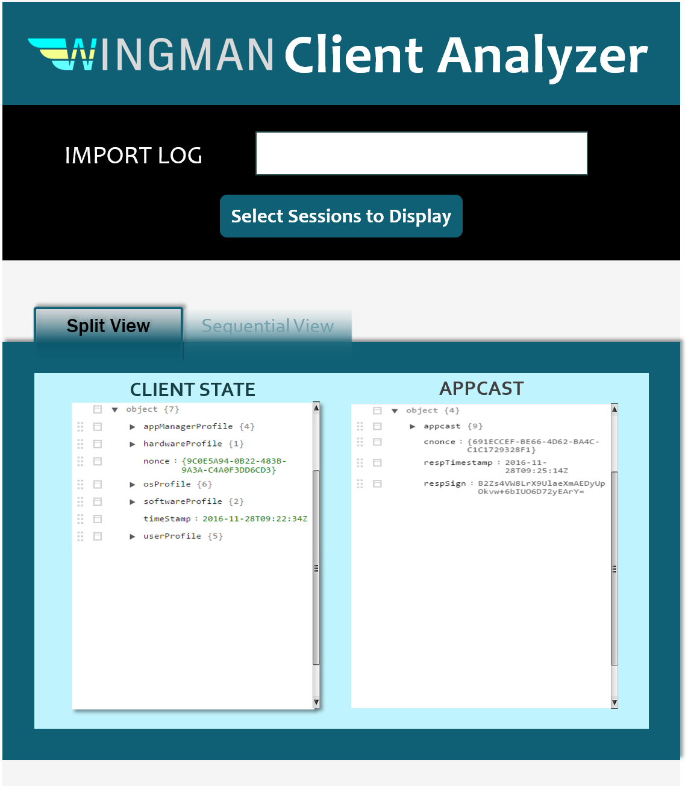
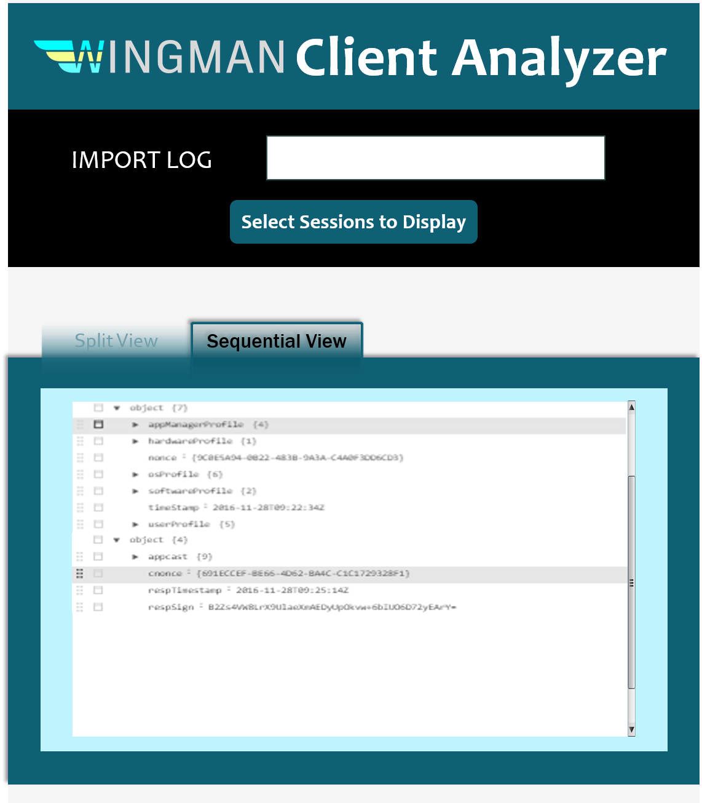
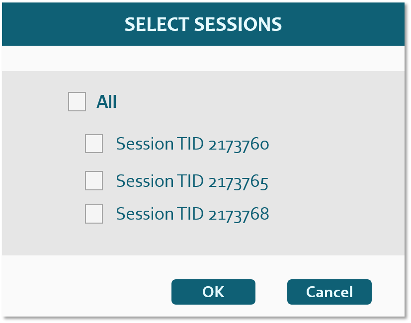

# Wingman Client Analyzer

To start the app, there are 3 distinct ways:

1. Open the app deployed on heroku online `heroku open`

2. Open the app deployed on heroku locally `heroku local web`

3. Open the app locally `node app.js` or `npm start`

## Commands

- `webpack` bundle the js files or `npm run build`
- `webpack-dev-server` for starting the local server or `npm run dev` or `npm dev`
- To check if the view is correct, just simply open `index.html` in a browser.

## Source
[arishuynhvan/wingman-client-analyzer](https://github.com/arishuynhvan/wingman-client-analyzer)

## Technical

1. Bundle all js files with [Webpack](https://medium.com/@rajaraodv/webpack-the-confusing-parts-58712f8fcad9#.ude8bl5u4). Require function is from CommonJS

2. Add new js files into the webpack.config.js entry, so all js files will be placed in the bundle.js file => single js script in index.html

3. [JSON Editor by josdejong](https://github.com/josdejong/jsoneditor)

4. File retrieval is empowered by FileSystem API
  1. [HTML5 `<input>` element](https://www.html5rocks.com/en/tutorials/file/dndfiles/#toc-selecting-files)
    1. Use `type="file"` property
    2. Use `<label>` to mask the input element and take control over the displayed text on button and file name

5. A lot of errors in webpack build haven't been resolved, but basically bundle.js still contains the right code, so not bothering now

6. May eventually need to modify jsoneditor for displaying multiple json objects

7. Bundlejs is only tracked by git in release branch since it's meant for deploying to Heroku. In all other branches, it's nessary to rebuild with `webpack` if bundlejs file is missing from `dist/JS` folder

## Developer's Stories

1. The application will retrieve a simple log file of wingman client

2. There are 2 views: Senquential, Split

3. The objects can be filtered by sessions

3. Key & Value pairs are displayed neatly (preferably in a table)

## Design
### Initial
#### Split View

#### Sequential View

#### Filter

### Material Design
#### Split View

#### Sequential View

#### Filter

## TODOs

- [x] Design UI

- [ ] Set up HMR for webpack

- [ ] Implement file importing, reading & extracting
  - [ ] Client State
  - [ ] Appcast
  - [ ] Session period (start & end time stamp)

- [ ] JSON Schema for displaying multiple JSON objects with JSON editor

- [ ] Convert JSON strings to object & pass to view layer

- [ ] Implement the session filter

- [x] Disable editable & insertable(not done) options

- [ ] Style as the initial design

- [ ] Clean the webpack build errors

## Shortcut keys

### Tree Editor

Key                     | Description
----------------------- | ------------------------------------------------
Alt+Arrows              | Move the caret up/down/left/right between fields
Ctrl+Shift+Arrow Up/Down| Select multiple fields
Ctrl+Enter              | Open link when on a field containing an url
Ctrl+E                  | Expand or collapse field
Alt+End                 | Move the caret to the last field
Ctrl+F                  | Find
F3, Ctrl+G              | Find next
Shift+F3, Ctrl+Shift+G  | Find previous
Alt+Home                | Move the caret to the first field
